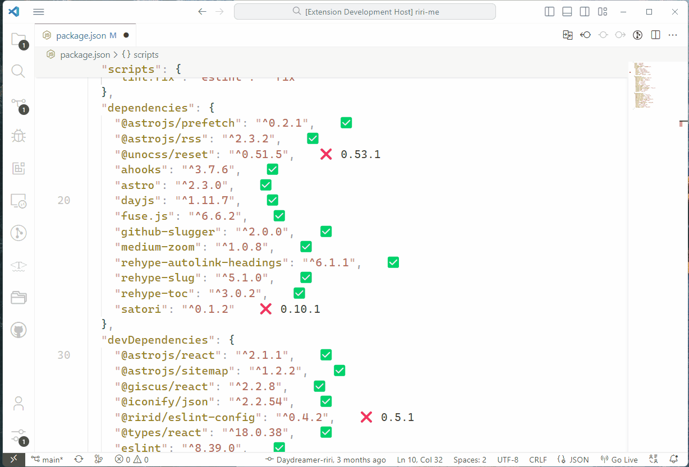

# packages

This is packages, an extension for node dependencies. Aims helping developers to manage dependencies while using _package.json_.

## Features

- Displays the latest version of the package next to it.
- Shows all versions (clickable) on the tooltip of the crate hovered.

## Preview

## Thanks

`packages` is inspired by [crates](https://github.com/serayuzgur/crates), which is an extension for managing Rust dependencies.

## License

[MIT](./LICENSE) License © 2023 [Riri](https://github.com/Daydreamer-riri)
